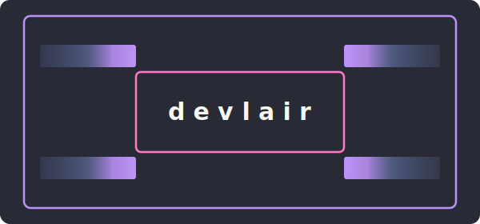

<div align="center">

<picture>
  <source media="(prefers-color-scheme: dark)" srcset="assets/logo.svg">
  <source media="(prefers-color-scheme: light)" srcset="assets/logo-light.svg">
  
</picture>

**One command to provision a fully configured Ubuntu or WSL development machine.**

[](https://github.com/ettoreaquino/devlair/releases/latest)
[](https://github.com/ettoreaquino/devlair/actions)
[](https://ubuntu.com)
[](LICENSE)

</div>

---

devlair automates the setup of a fresh Ubuntu server, workstation, or WSL instance — installing tools,
hardening security, configuring shell and terminal with the [Dracula](https://draculatheme.com) theme,
and wiring up dev toolchains. Run it once on a fresh machine or re-run anytime to converge.

## Quick start

```bash
curl -fsSL https://raw.githubusercontent.com/ettoreaquino/devlair/main/install.sh | sudo bash
devlair init
```

That's it. The installer downloads a prebuilt binary for your architecture and places it in `/usr/local/bin`. `devlair init` takes care of the rest.

> [!NOTE]
> **Preview the v2 alpha** with `curl ... | sudo bash -s -- --pre`. The v2 rewrite drops `sync`, `filesystem`, and `claw` — pin to v1 if you depend on them. See [v2 (TypeScript + Ink — alpha)](#v2-typescript--ink--alpha).

## Why devlair

<table>
<tr>
<td width="33%" valign="top">

**Idempotent**

Run it once or a hundred times — devlair always converges to the desired state. Re-run after a failure, on a new machine, or just to update your config.

</td>
<td width="33%" valign="top">

**Security-first**

SSH hardening, UFW firewall, Fail2Ban, and Tailscale VPN are set up out of the box on Linux. On WSL, network modules that require `systemctl` are auto-skipped. Disable password auth with a single command when you're ready.

</td>
<td width="33%" valign="top">

**Composable**

13 modules you can run individually with `--only` or skip with `--skip`. Each module is self-contained and does one thing well.

</td>
</tr>
</table>

## Commands

<!-- Version in the help snapshot is static; update when cutting a release. -->

```
╭────────────────────────────────────────────────╮
│  ░░▒▒▓▓██                            ██▓▓▒▒░░  │
│               ╔═══════════════╗                │
│               ║ d e v l a i r ║                │
│               ╚═══════════════╝                │
│  ░░▒▒▓▓██                            ██▓▓▒▒░░  │
╰────────────────────────────────────────────────╯
  vX.Y.Z

  Setup & Health
    init [--only MOD] [--skip MOD] [--group GRP] [--config FILE]  Interactive wizard (or non-interactive with flags)
    doctor [--fix]                      Check system health & fix drift
    upgrade [--no-self]                 Upgrade tools & re-apply configs
    disable-password                    Lock SSH to key-only auth

  Cloud & Filesystem
    sync [--add|--remove|--now]         Manage rclone folder syncs
    filesystem                          AI-guided folder structure design

  AI Agents & Channels
    claude [--plan TIER] [--1m on|off]  Usage dashboard & config

  tmux Sessions
    t                                   Start/attach default 'dev' session
    tmx <name>                          Attach to a named session
    tmx new --name N                    Create a plain session
    tmx new --name N --claude           Session with Claude Code
    tmx new --name N --claude-telegram  Create Telegram channel
    Ctrl+A  y                           Claude Code popup (any session)

  Options:  --version -v  Show version    --help  Show this screen
```

## Usage examples

```bash
# Interactive wizard — walks you through group and module selection
devlair init

# Run specific modules only
devlair init --only ssh,tmux

# Run module groups
devlair init --group core,coding

# Install opt-in modules
devlair init --only claude,rclone

# Skip specific modules
devlair init --skip devtools,gnome_terminal

# Setup from a YAML profile
devlair init --config setup.yaml

# Check system health
devlair doctor

# Diagnose and auto-fix config drift
devlair doctor --fix

# Upgrade all tools + re-apply configs + update devlair itself
devlair upgrade
```

<details>
<summary><b>Cloud sync</b></summary>

```bash
# Show configured cloud syncs and timer status
devlair sync

# Configure a new cloud folder sync (interactive)
devlair sync --add

# Configure with a preset name
devlair sync --add --name store

# Run all syncs immediately
devlair sync --now

# Remove a configured sync
devlair sync --remove

# Remove a specific sync by name
devlair sync --remove --name store
```

</details>

<details>
<summary><b>Claude Code dashboard</b></summary>

```bash
# Claude Code usage dashboard
devlair claude

# Set your Claude Max plan tier
devlair claude --plan max5x

# Show Telegram channel configuration
devlair claude --channels
```

</details>

<details>
<summary><b>tmux sessions</b></summary>

```bash
# Start/attach default session
t

# Attach to a named session
tmx work

# Create a new session
tmx new --name work

# Create session with Claude Code running
tmx new --name work --claude

# Create a Telegram bot session
tmx new --name support --claude-telegram
```

</details>

## Claude Code integration

devlair hooks into Claude Code to track session usage and display a dashboard:

```
╭──────────────────────── devlair  claude  max5x ─────────────────────────╮
│  session  ████░░░░░░░░░░░░░░░░░░  7%  ~$4.20  3.1M in 25K out         │
│                                        resets in ~3h38m                │
│                                                                        │
│  all models  ██░░░░░░░░░░░░░░░░░░░░  4%  ~$78  45M in 170K out        │
│                                        resets Fri 09:00 AM · 20 sess.  │
│                                                                        │
│  sonnet only  █░░░░░░░░░░░░░░░░░░░░░  2%  ~$12  27M in 77K out        │
│                                        resets Mon 09:00 AM · 7 sess.   │
╰────────────────────────────────────────────────────────────────────────╯
```

- **Session** — 5h rolling window: percentage of estimated plan budget, cost at API rates, token counts, reset countdown
- **All models** — weekly usage against total budget, resets every Friday 09:00; session count
- **Sonnet only** — weekly Sonnet usage tracked separately, resets every Monday 09:00
- **Plan-aware** — supports `pro`, `max5x`, and `max20x` tiers (`devlair claude --plan <tier>`)
- **Automatic hooks** — `SessionStart` and `Stop` hooks in `~/.claude/settings.json` track sessions for the tmux status bar

## What gets installed

`devlair init` runs these modules in order. Some modules are **opt-in** and not included in a default run — use `devlair init --only <module>` or `--group` to enable them. Opt-in modules: `rclone`, `claude`; `tailscale` is opt-in on WSL.

<details>
<summary><b>System</b> — OS packages and essentials</summary>

Runs `apt update && upgrade` and installs core packages: `git`, `curl`, `vim`, `htop`, `tmux`, `zsh`, `bat`, `fzf`, `build-essential`, `ufw`, `fail2ban`, and more.

</details>

<details>
<summary><b>Timezone</b> — interactive timezone configuration</summary>

Displays the current timezone and prompts for a new one. Uses `timedatectl` under the hood.

</details>

<details>
<summary><b>Tailscale</b> — VPN for secure remote access</summary>

Installs [Tailscale](https://tailscale.com) and walks you through browser-based authentication. Your Tailscale IP is used to restrict SSH access.

</details>

<details>
<summary><b>SSH</b> — hardened configuration + key setup</summary>

Creates `/etc/ssh/sshd_config.d/99-hardened.conf` with:
- Root login disabled
- Public key auth enabled
- Max 3 auth attempts
- ListenAddress restricted to Tailscale IP (when available)

Prompts for your SSH public key if `authorized_keys` is empty.

</details>

<details>
<summary><b>Firewall</b> — UFW + Fail2Ban</summary>

Resets and configures UFW (default deny incoming, allow outgoing). Sets up Fail2Ban with 1-hour ban times and 3 max retries.

</details>

<details>
<summary><b>Zsh</b> — shell + Dracula prompt</summary>

Installs zsh, sets it as default, and configures [zimfw](https://zimfw.sh) with:
- [Dracula](https://draculatheme.com) prompt theme
- `zsh-autosuggestions`
- `zsh-syntax-highlighting`
- `zsh-completions`

</details>

<details>
<summary><b>tmux</b> — Dracula-themed multiplexer</summary>

Writes `~/.tmux.conf` with Dracula colors, `C-a` prefix, mouse support, 50k line history, and intuitive split bindings (`|` and `-`). Vi copy-mode with mouse drag selection piped to the system clipboard (`wl-copy` on Wayland, `xclip` on X11, OSC 52 fallback). Installs `wl-clipboard` automatically when no clipboard tool is found. Includes [TPM](https://github.com/tmux-plugins/tpm), [tmux-resurrect](https://github.com/tmux-plugins/tmux-resurrect) + [tmux-continuum](https://github.com/tmux-plugins/tmux-continuum) for automatic session save/restore — TPM plugins are installed non-interactively during init/upgrade. Claude Code popup on `C-a y`.

</details>

<details>
<summary><b>Dev tools</b> — 8 essential tools</summary>

Installs (skipping any that already exist):

| Tool | Purpose |
|------|---------|
| [uv](https://docs.astral.sh/uv/) | Python package manager |
| [pyenv](https://github.com/pyenv/pyenv) | Python version manager + latest LTS |
| [nvm](https://github.com/nvm-sh/nvm) | Node.js version manager + LTS |
| [fzf](https://github.com/junegunn/fzf) | Fuzzy finder |
| [Docker](https://www.docker.com/) | Containers + Compose |
| [gh](https://cli.github.com/) | GitHub CLI |
| [aws](https://aws.amazon.com/cli/) | AWS CLI v2 |
| [Bun](https://bun.sh/) | JavaScript runtime (required for Claude Code channels) |

</details>

<details>
<summary><b>rclone bisync</b> — bidirectional cloud sync via systemd timer</summary>

rclone is opt-in: install it with `devlair init --only rclone`. Then run `devlair sync --add` to configure a sync:
- Prompts for a short sync name (e.g. `store`, `vault`) used as the systemd unit identifier
- Walks through `rclone config` for OAuth (Google Drive, S3, and [70+ providers](https://rclone.org/overview/))
- Creates a named systemd user timer (`rclone-<name>.timer`) that bisyncs every 5 minutes
- Runs an initial `bisync --resync` to bootstrap state immediately after setup

`devlair sync` shows timer status and last run time per configured sync. `devlair sync --remove` stops and deletes a sync's systemd units and log file (does not touch the rclone remote or local files). The login banner automatically shows synced drives when service files are present. `devlair upgrade` keeps rclone up to date and reports timer health.

</details>

<details>
<summary><b>GitHub</b> — SSH key + git config</summary>

Generates an `ed25519` SSH key for GitHub, configures `~/.ssh/config`, tests the connection, and sets `git` user/email globally.

</details>

<details>
<summary><b>Shell</b> — aliases + login banner</summary>

Appends aliases to `.zshrc` (`ll`, `..`, `ports`, `dps`, `t` for tmux, `bcat` → `bat`, etc.) and a `tmx` command for session management. The login banner shows live tmux sessions and named channel sessions:

```
╭─ myhost ──────────────────────────────────────╮
│  100.64.0.1  disk 3.2G/50G  mem 8.1G/15G     │
│                                               │
│  tmux:                                        │
│    dev                       → tmx dev        │
│    work                      → tmx work       │
│                                               │
│  channels:                                    │
│    ● work-bot                → tmx work-bot   │
│    ○ staging-bot             → tmx staging-bot│
╰───────────────────────────────────────────────╯
```

`●` = token configured and at least one user authenticated; `○` = session exists but not yet ready.

</details>

<details>
<summary><b>GNOME Terminal</b> — Dracula color scheme</summary>

Applies the full 16-color Dracula palette to your default GNOME Terminal profile.

</details>

<details>
<summary><b>Claude Code</b> — hooks, settings, channels, and status bar</summary>

Merges devlair-managed keys into `~/.claude/settings.json` (model, effort level, session hooks, channels). Enables Claude Code [channels](https://docs.anthropic.com/en/docs/claude-code/channels) with the Telegram plugin — deploys `claude-telegram` and `tmx-new` commands. The tmux status bar shows the active model and channel count (`CC:sonnet CH:1`). Named Telegram sessions are created via `tmx new --name <n> --claude-telegram`; each gets an isolated bot state dir and appears in the login banner. Use `devlair claude --channels` to view configuration.

</details>

## Health check

```bash
devlair doctor
```

Verifies every component without making changes — checks installed tools, config files, service status, and SSH connectivity. Use `--fix` to automatically re-apply configurations and install missing dev tools for modules with detected drift.

## Upgrading

```bash
devlair upgrade
```

Checks for a new devlair binary first — if a new version is available, it downloads, replaces, and re-execs so the rest of the upgrade runs new code. Then upgrades system packages and any tools that were installed during init (Docker, GitHub CLI, AWS CLI, pyenv/Python, nvm/Node, Bun, rclone). After upgrading, automatically re-applies module configurations (hooks, settings, shell aliases) so new config shapes take effect immediately. Reports rclone sync timer health when configured. Use `--no-self` to skip the binary update.

## Requirements

- **OS:** Ubuntu 24.04 LTS or WSL 2 (Ubuntu)
- **Arch:** x86_64 or aarch64
- **Privileges:** root or a user with `sudo`
- **WSL extras:** Docker Desktop for Windows with WSL integration enabled (for Docker-dependent modules)

## Development

### v1 (Python — stable)

```bash
git clone git@github.com:ettoreaquino/devlair.git
cd devlair
uv sync --group dev
uv run pytest tests/unit/
uv run ruff check devlair/ tests/
```

### v2 (TypeScript + Ink — alpha)

> [!WARNING]
> v2 is in early alpha. The TypeScript + Ink rewrite is under active development.
> For the stable CLI, use the [v1.x releases](https://github.com/ettoreaquino/devlair/releases/latest).

**Try the alpha:**

```bash
curl -fsSL https://raw.githubusercontent.com/ettoreaquino/devlair/main/install.sh | sudo bash -s -- --pre
```

This downloads the latest `devlair-cli-v*` prerelease asset and installs it as `/usr/local/bin/devlair`, replacing v1. To roll back, re-run the installer without `--pre`.

**Removed in v2** (vs. v1):

| Command | Replacement |
|---------|-------------|
| `devlair sync` | Pin to v1 or run `rclone bisync` directly |
| `devlair filesystem` | Removed — not ported |
| `devlair claw` | Removed — not ported |

**Develop locally:**

```bash
cd cli
bun install
bun run dev          # run in development
bun run typecheck    # tsc --noEmit
bun run lint         # biome check
bun run compile      # standalone binary → dist/devlair
```

### Releasing

Releases are automated via [release-please](https://github.com/googleapis/release-please). Conventional Commits on `main` determine version bumps (`fix:` → patch, `feat:` → minor, `feat!:` → major). Release-please maintains a "Release PR" with the changelog; merging it triggers a GitHub Release and binary builds for both architectures. **Never tag manually.**

### Project structure

```
devlair/                # v1 Python CLI (stable)
  cli.py               # Typer CLI entrypoint
  runner.py             # subprocess helpers
  context.py            # shared types, user resolution, JSON config helpers
  console.py            # Rich console + Dracula color tokens
  modules/              # one file per init module (13 modules)
  features/             # doctor, upgrade, disable-password, filesystem, claude, sync, audit, profile
cli/                    # v2 TypeScript CLI (alpha)
  src/
    index.tsx           # Ink app entrypoint
    commands/           # command implementations (init, doctor, upgrade)
    components/         # Ink UI components (Logo, Help)
    wizard/             # interactive wizard (GroupSelect, ModuleSelect, Confirmation)
    lib/                # theme, types, runner, modules, platform detection
assets/
  logo.svg              # brand mark (dark background)
  logo-light.svg        # brand mark (light background variant)
install.sh              # curl-pipe installer
```

## License

[MIT](LICENSE)
